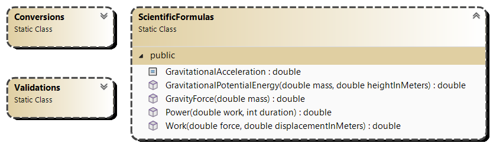
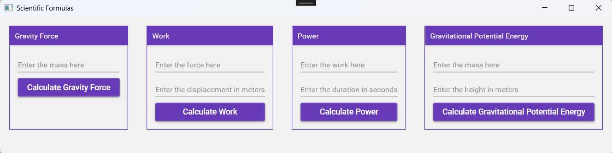

# Statics Exercise

# Exercise 1 – Scientific Formulas

## Objective
- Working with static methods  
- Working with multiple Windows  
- Working with MaterialDesign  
- Working with Class Libraries and Classes  

## Class Design  

- Define acceleration as a constant in the static class `ScientificFormulas`!  
  The gravitational acceleration is **9.81**.  
- Formulas:  
  - **Gravity Force** = mass × gravitational acceleration  
  - **Work** = force × displacementInMeters  
  - **Power** = work × duration  
  - **Gravitational Potential Energy** = mass × gravitational acceleration × heightInMeters  
    → Use the **gravity force** formula  

## Design

### Scientific Formulas

### Validations  

## Implementation  

- Call the corresponding methods when clicking the different buttons.  
- Ensure validation is performed on numerical fields!  
