# Singular Relationships Exercises

## Setup
- Create a project. The solution name must be:`SingularRelationshipsExercises`, the project name: `SingularRelationshipsExercises_WPF`.
- Update the MainWindow to navigate to the exercises.

### Design

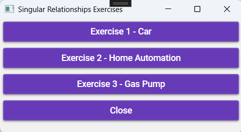

## Exercise 1 – Car

### Objective
- Working with static methods  
- Working with multiple Windows  
- Working with MaterialDesign  
- Working with Class Libraries and Classes  

### Class Design  

- **Show as Association (1)**

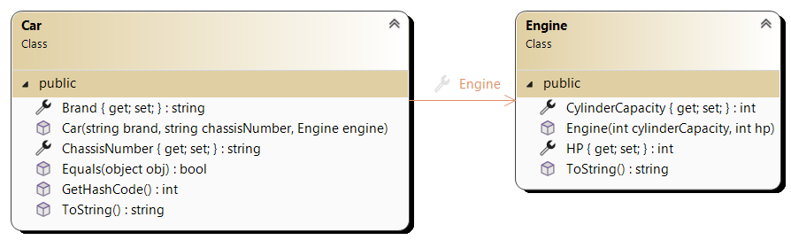

- **Show as Property (2)**  

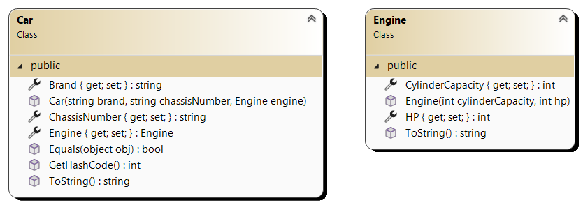

#### Extra Information about the `Engine` Class:
- **ToString:** Returns a textual representation of the object  
  `Cylinder capacity: CylinderCapacity – HP: HP`  

#### Extra Information about the `Car` Class:
- **Equals:** Two cars are considered the same if the chassis number is identical.  
- **ToString:** Returns a textual representation of the object  
  `The Brand with chassis number ChassisNumber has the following characteristics:`  
  `Cylinder capacity: CylinderCapacity – HP: HP` → Use a method from the `Engine` object  

### Design  

#### MainWindow

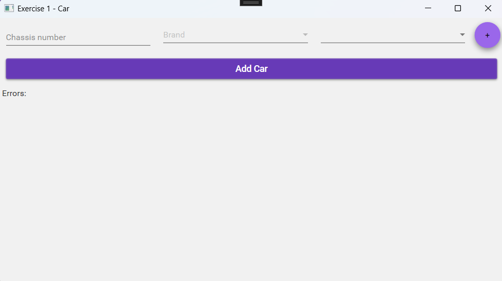

#### EngineWindow  

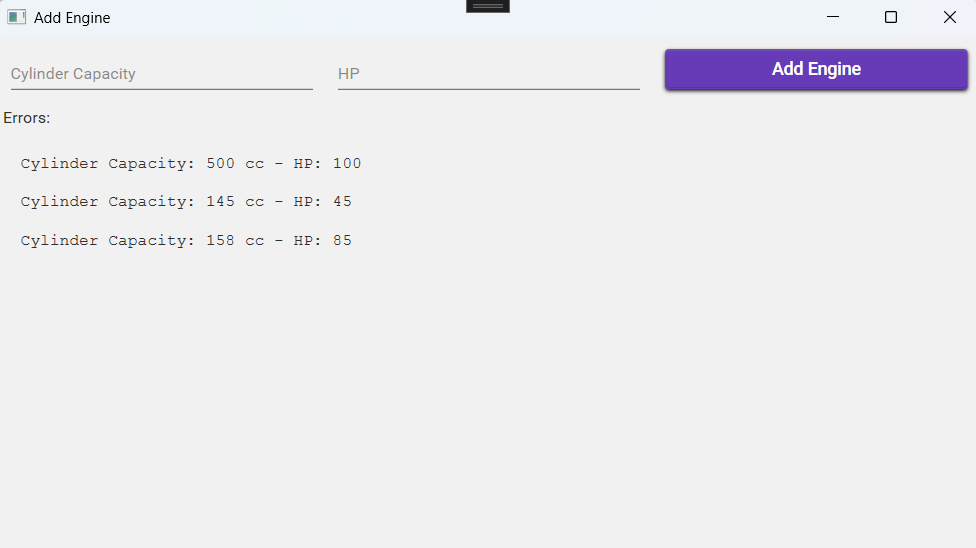

### Implementation  

#### `EngineWindow`
- When loading the form, a text file `engines.txt` is read.  
  The file structure:
```
CylinderCapacity;HP
CylinderCapacity;HP
CylinderCapacity;HP
```
- The data is used to create a `Engine` object, which is added to a list.  
- Use a **DAL (Data Access Layer)**. Any errors **MUST** be handled properly!  
- The list must be linked to the `ListBox`.  
- Ensure no errors occur if the file is empty or does not yet exist!  

- In this screen, a engine can be created using **cylinder capacity** and **HP**.  
- **Validation is required!** If input is incorrect, an error message is displayed in the label `lblErrors`.  
- **Example:** If `cylinder capacity` is not entered, an error message should be shown.

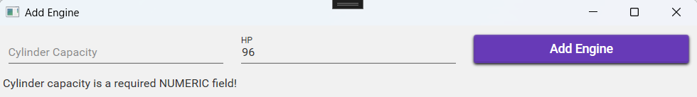

- If fields are correctly filled:  
- A `Engine` object is created and added to the file and `ListBox`.  
- After a successful addition, the fields are cleared.

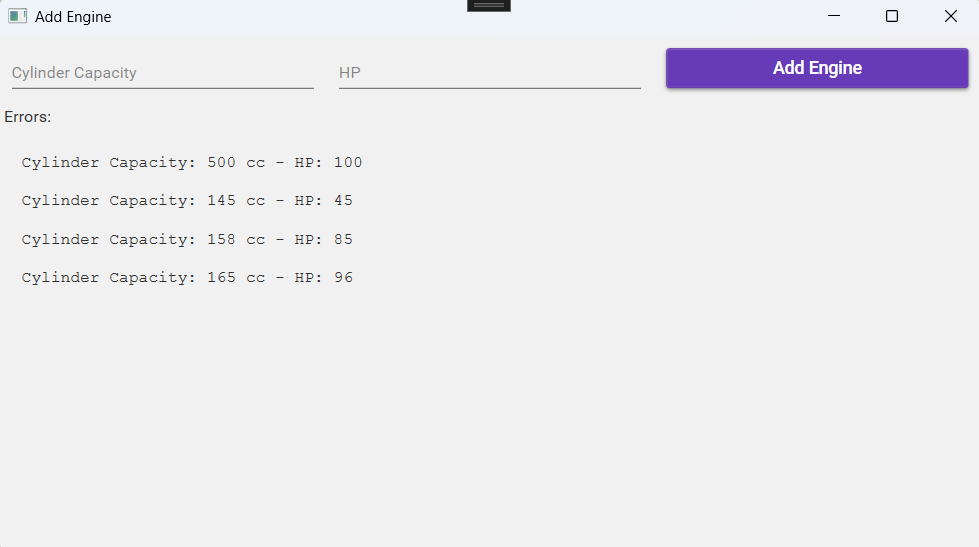

- When closing the form, the `MainWindow`'s `cmbEngines` `ComboBox` must be updated.  

#### `MainWindow`
- Clicking the `+` button opens the `EngineWindow`.  
- When loading the form, the `brands.txt` file is read.  
The file structure: 
```
Brand
Brand
Brand
```

- The data is added to a list.  
- Use a **DAL layer**. Any errors **MUST** be handled properly!  
- The list must be linked to the `ComboBox cmbBrands`.  
- Ensure no errors occur if the file is empty or does not yet exist!  

- When loading the form, the `cmbEngines` `ComboBox` is populated using an existing method in the **DAL layer**.  
- In this screen, a car can be created with **chassis number, brand, and engine**.  
- **Validation is required!** If input is incorrect, an error message is displayed in the label `lblErrors`.  
- **Example:** If no engine is selected, an error message should be shown.

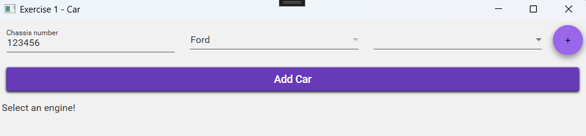

- If fields are correctly filled:  
- A `Car` object is created and added to the list.  
- The `ListBox` is updated.  
- After a successful addition, the fields are cleared. 

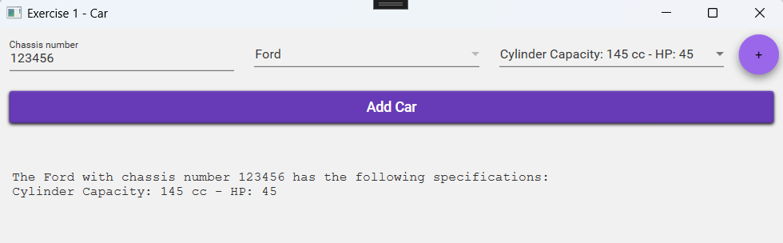

---

## Exercise 2 – Home Automation

### Objective
- Working with static methods  
- Working with multiple Windows  
- Working with MaterialDesign  
- Working with Class Libraries and Classes  

### Class Design  

- **Show as Association (1)**  

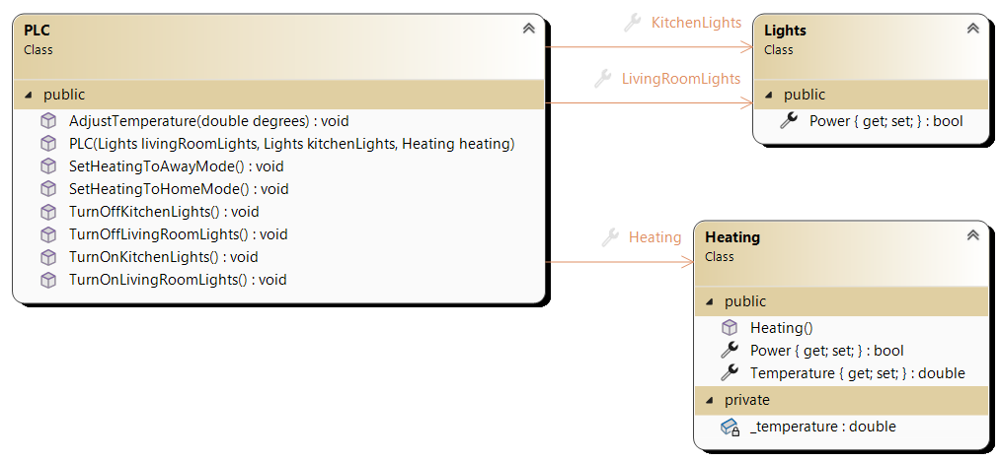

- **Show as Property (2)**  

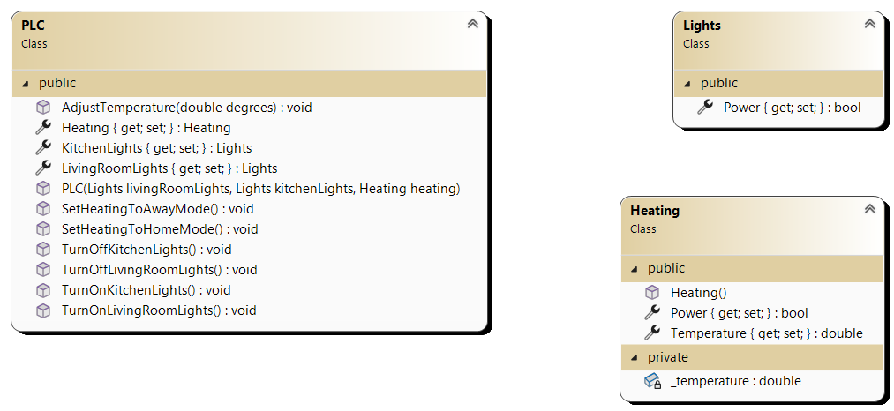

#### Extra Information about the `Heating` Class:
- **Property `Temperature`:** The temperature cannot drop below the minimum and can only be adjusted if the heating is on.  

#### Extra Information about the `PLC` Class:
- **Properties `LivingRoomLights`, `KitchenLights`, and `Heating`** are **not externally adjustable**, only readable.  
- **Methods:**  
- `SetHeatingToAwayMode()`: Sets temperature to **18°C**.  
- `SetHeatingToHomeMode()`: Sets temperature to **21°C**.  
- `AdjustTemperature(value)`: Adjusts the temperature to the specified value.  

### Design  

- Start from the **starter project** and extend the design accordingly.

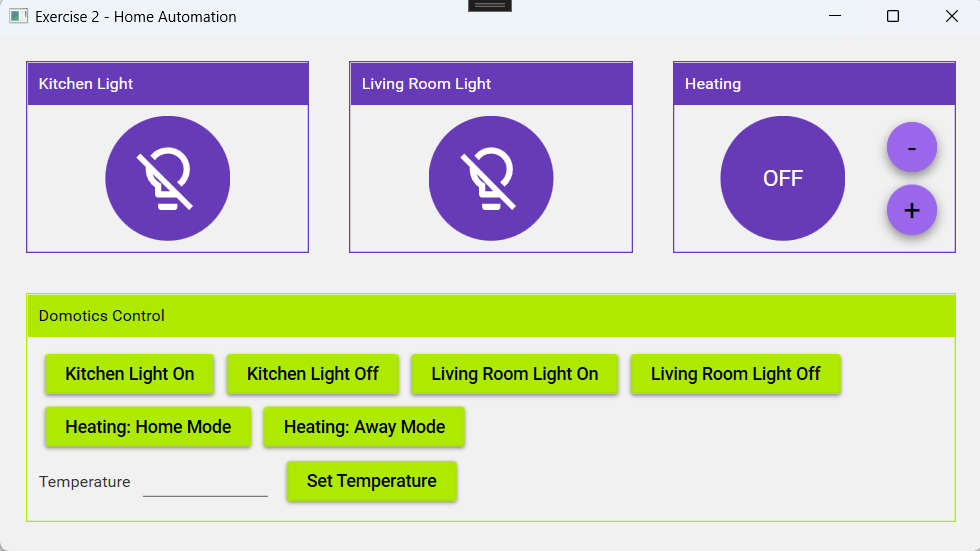

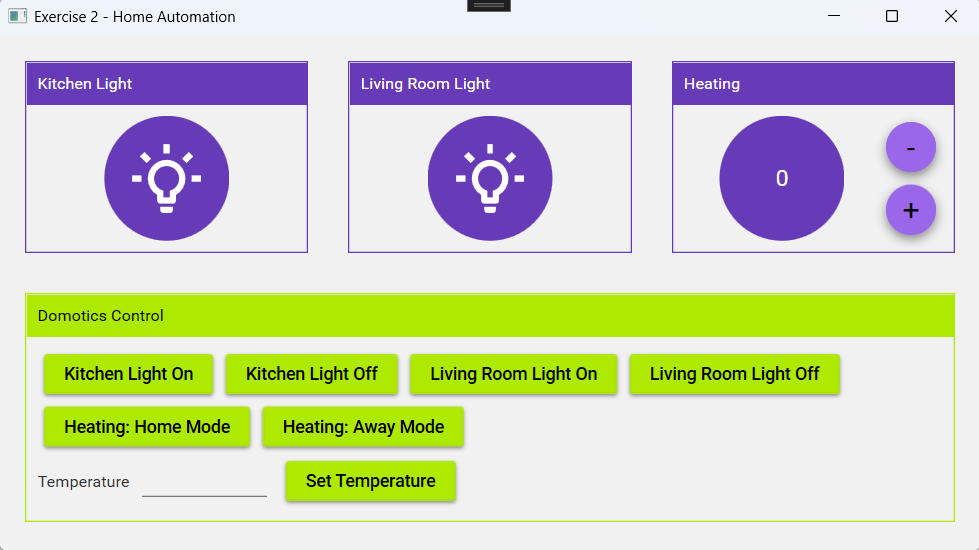

### Implementation  

- First, implement the logic **using individual elements**:  
- Create three objects in the form: `kitchenLights`, `livingRoomLights`, and `heating`.  
- The `ToggleButton` switches the associated object **on or off**.  
- If heating is on, the temperature is displayed on the `ToggleButton`. Otherwise, it shows `"OFF"`.  
- The `+` and `-` buttons adjust the temperature by **±1**.  
- This should only work when heating is **on**.  

- Then, implement **the home automation logic**:  
- Create a `PLC` object using the **constructor with parameters**.  
- Call the appropriate methods when buttons are pressed.  
- **The `ToggleButtons` must always reflect the current state** of the element, whether changed via the element itself or the `PLC`.  

---

## Exercise 3 – Gas Pump

### Objective
- Working with static methods  
- Working with multiple Windows  
- Working with MaterialDesign  
- Working with Class Libraries and Classes  

### Class Design  

- **Show as Association (1)**  


- **Show as Property (2)**  

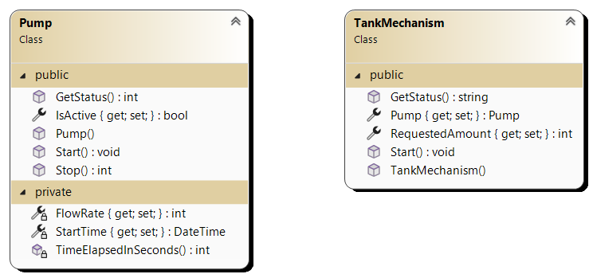

#### Extra Information about the `Pump` Class:
- **Constructor:**  
  - The pump is initially **inactive**.  
  - The **flow rate** is randomly set between **5 and 10 liters per X seconds**.  
- **Method `CalculateTimeDifference()`** → Add the following code:  
```csharp
private int CalculateTimeDifference()
{
    DateTime now = DateTime.Now;
    TimeSpan diff = now.Subtract(StartTime);
    return diff.Hours * 3600 + diff.Minutes * 60 + diff.Seconds;
}
```

- **Method `Start()`**:
  - Activates the pump
  - Sets `StartTime = DateTime.Now`
- **Method `GetStatus()`**:
  - Returns 0 if the pump is inactive
  - Otherwise, returns `flow rate × CalculateTimeDifference()`
- **Method `Stop()`**:
  - Deactivates the pump
  - Returns `GetStatus()`

#### Extra Information about the `TankMechanism` Class:

- **Constructor:**
  - Initializes the `Pump` object
  - Sets RequestedAmount = 0
- Method `Start()`:
  - Activates the pump
- Method `GetStatus()`:
  - If pump is inactive: `"The pump has not started"`
  - If the fuel amount is sufficient: `"Enough fuel pumped, pump stopped after 'State' liters."`
    - Stops the pump
  - While fueling: `"Pump is fueling; already 'State' liters"`

### Design

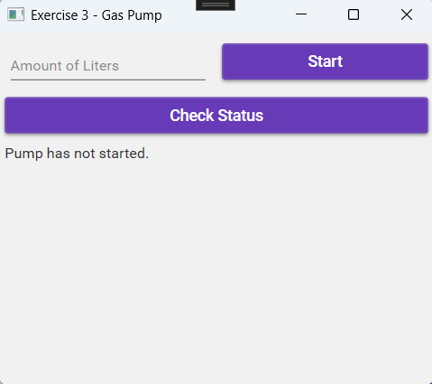

#### Implementation

- When the form loads, a Counter object is created.

- Pressing "Start":

  - First, sets `RequestedAmount` in `TankMechanism`.
  - Then, starts the Counter object.
  - Validation is required! If input is incorrect (non-numeric), an error message should appear.

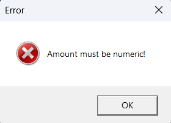

- Pressing "Check Status":
  - Retrieves the current status from `TankMechanism`.

#### Extension
- Instead of manually clicking `"Check Status"`, automate this process using a DispatcherTimer.
- Learn more: [WPF DispatcherTimer Tutorial](https://www.wpf-tutorial.com/misc/dispatchertimer/)