# Multiple Relationships Exercises

## Setup
- Create a project. The solution name must be:`MultipleRelationshipsExercises`, the project name: `MulitpleRelationshipsExercises_WPF`.
- Update the MainWindow to navigate to the exercises.

### Design

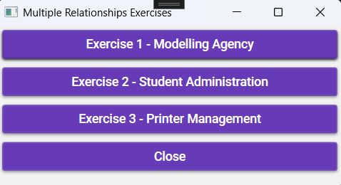

## Exercise 1 – Modeling Agency

### Objectives
- MaterialDesign: GroupBox, Button, TextBox, CheckBox
- Class Library
- Multiple Relationships

### Class Design

#### Show as Association (1)

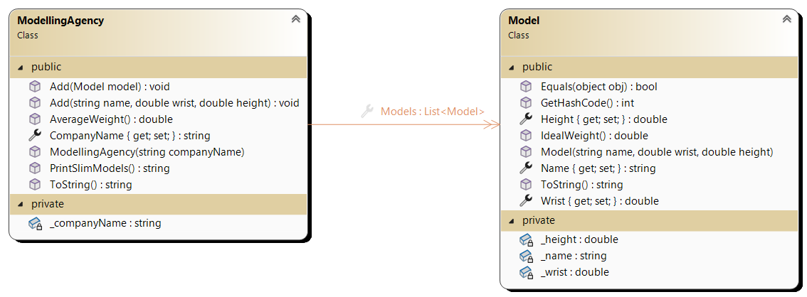

#### Show as Property

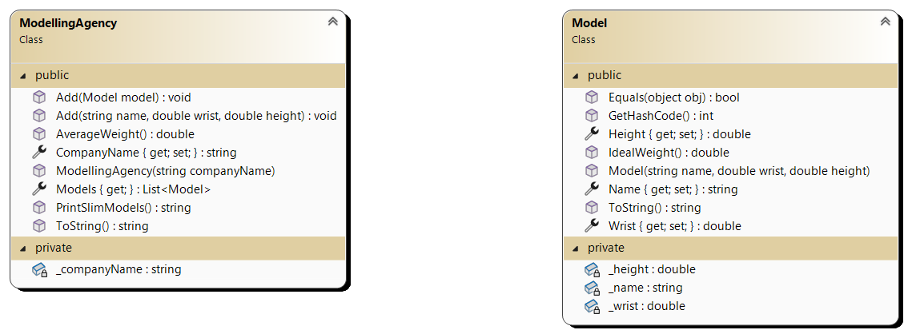

#### Additional Information – `Model` Class:
- **Property `Length`**: Throws an error if the value is less than 170 or greater than 195 with the message `"The ideal height is between 170 and 195."`
- **Property `WristCircumference`**: Throws an error if the value is less than 10 or greater than 20 with the message `"The ideal wrist circumference is between 10 and 20."`
- **Property `Name`**: Throws an error if the name is not provided with the message `"Model name is not provided!"`
- **Method `IdealWeight`**: Calculates the ideal weight of the model.			
`IdealWeight = (Length + 4 * WristCircumference – 100) / 2`
- **`ToString()`**: Returns the textual representation of the object as follows: `Name Length WristCircumference IdealWeight`

The ideal weight is rounded to one decimal place.

#### Additional Information – `ModellingAgency` Class:
- **Property `CompanyName`**: Throws an error if the name is not provided with the message `"Company name is not provided!"`
- **Method `Add`**: Adds a `Model` to the list.
- **Method `AverageWeight`**: Calculates the average ideal weight of all models.
- **`ToString()`**: Returns a textual representation of the modeling agency.
```
Agency CompanyName
Name Length Wrist Circumference Ideal Weight
Name Length Wrist Circumference Ideal Weight 
…
```

- **Method `PrintSlimModels`**: Lists the names of models whose ideal weight is less than 60.

```
CompanyName has the following ultra-slim models:
Name 
Name 
…
```

## UI Design

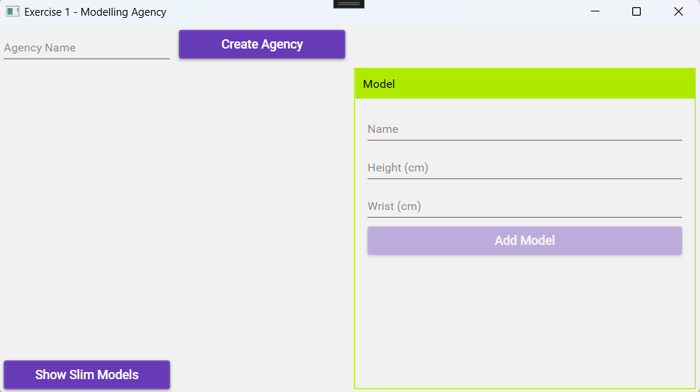

## Workflow

- Clicking **"Create Agency"** creates an agency with the given name.
- The agency is added to the agency list, which is linked to a list box.

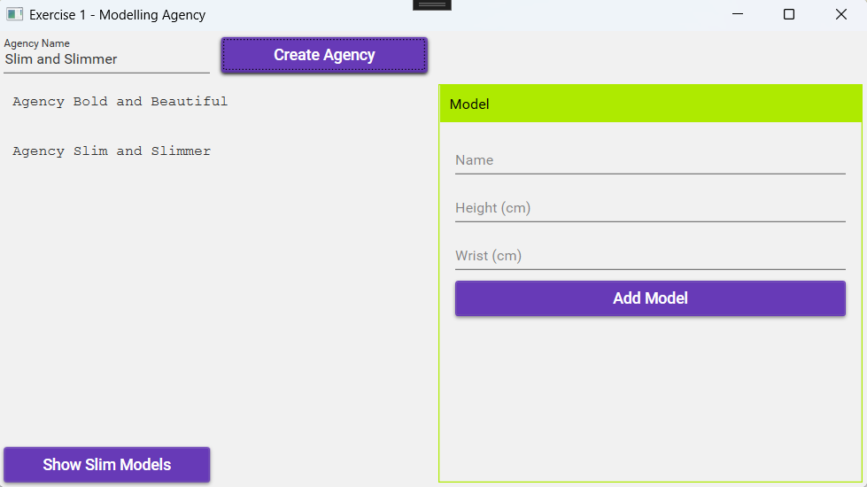

- Clicking **"Add Model"** adds a model to the selected agency.

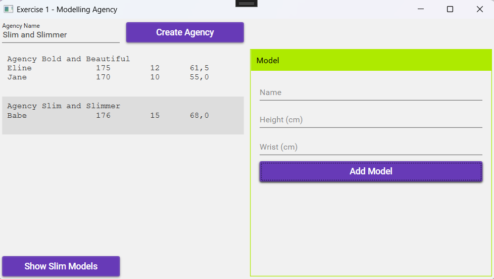

- Clicking **"Show Slim Models"** displays a MessageBox listing the slim models.

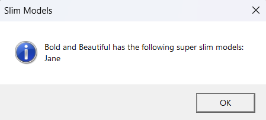

- Ensure validation and handle all errors!

---

## Exercise 2 – Student Administration

### Objectives
- MaterialDesign: GroupBox, Button, TextBox, CheckBox
- Class Library
- Inheritance
- Multiple Relationships

### Class Design

#### Show as Association (1)

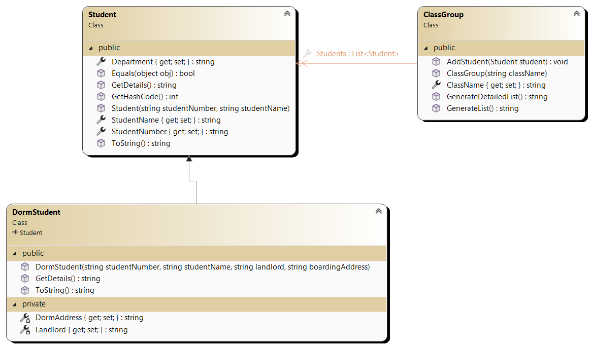

#### Show as Property (2)

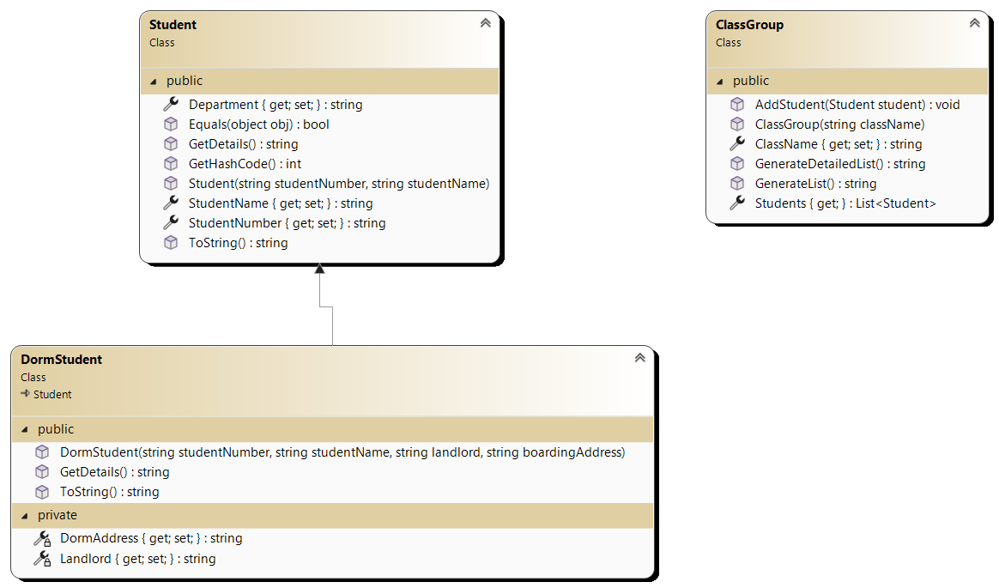

#### Additional Information – `Student` Class:
- **`ToString()`**: Returns the student's name in uppercase.
```
STUDENT NAME
```

- **Method `GetDetail`**: Returns the student number followed by the student's name. Ensure proper alignment!
```
Student Number Student Name
```

- **Method `Equals`**: Two students are equal if their student numbers match.
- **Method `GetHashCode`**: Return value is based on the `Equals` comparison.

#### Additional Information – `DormStudent` Class:
- **`ToString()`**: Returns the student’s name in uppercase with "(dorm student)" added. Uses the parent class.
```
STUDENT NAME (dorm student)
	Dorm Address: DormAddress (Owner: Owner)
```

#### Additional Information – `ClassGroup` Class:
- **Method `AddStudents`**: Adds a student/dorm student to the list if they do not already exist. If the student is already in the list, an error is thrown: `"This student has already been added"`
- **Method `GetList`**: Returns a list of all students in the class. Uses appropriate methods to avoid code repetition.
```
Student List for ClassName 
Student Name (optionally followed by dorm student) 
Student Name (optionally followed by dorm student)
…
```

- **Method `GetDetailedList`**: Returns a detailed list of all students in the class. Uses appropriate methods to avoid code repetition.
```
Student List for ClassName 
Student Number Student Name (optionally followed by dorm address)
Student Number Student Name (optionally followed by dorm address)
…
```

### UI Design

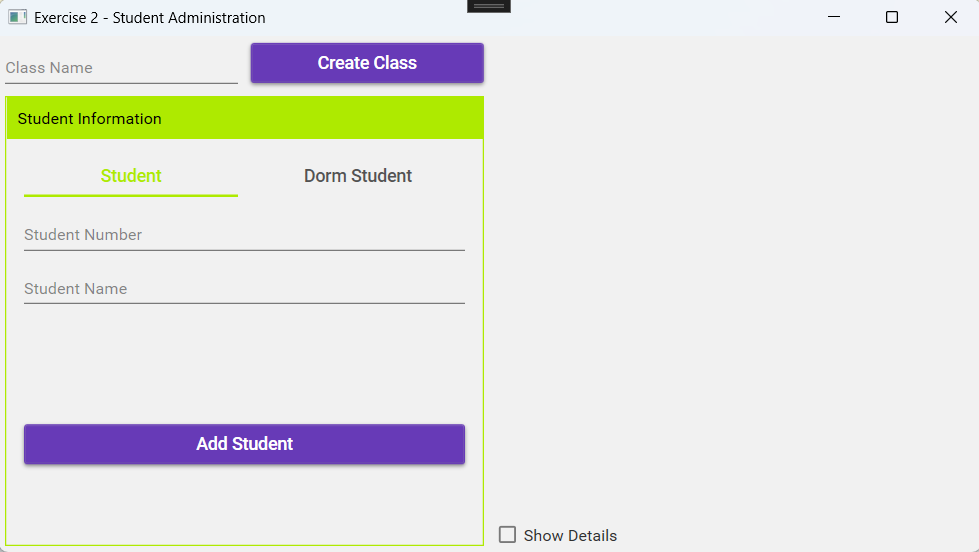

### Workflow

- Clicking **"Create Class"** creates a class with the given name.
- Validate class name input.

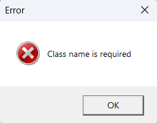

- Once a class is created, students can be added.
- Ensure proper validation.

**Example 1**: Students cannot be added if no class has been created.


**Example 2**: Required fields must be filled.


- Successfully adding a student displays class data in a text box.

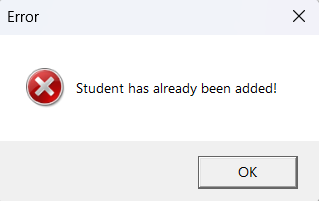

- If a duplicate student is added, an error message appears—handle this error!

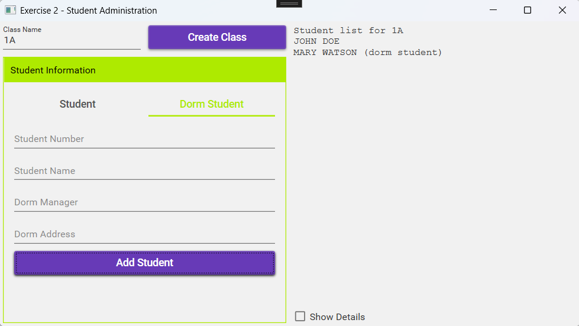

- Selecting **"Details"** displays a detailed description in the text box.

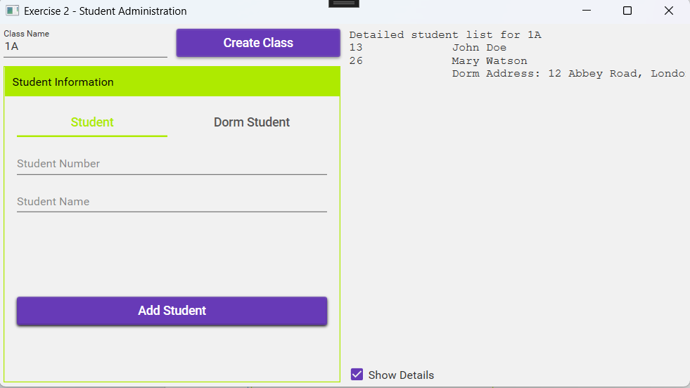

---

## Exercise 3 – Printer Management

### Objectives
- MaterialDesign: ToggleButton, Button
- Multiple Relationships
- Class Library

### Class Design

The **Computer** acts as a print server and distributes print jobs among the connected printers based on availability.

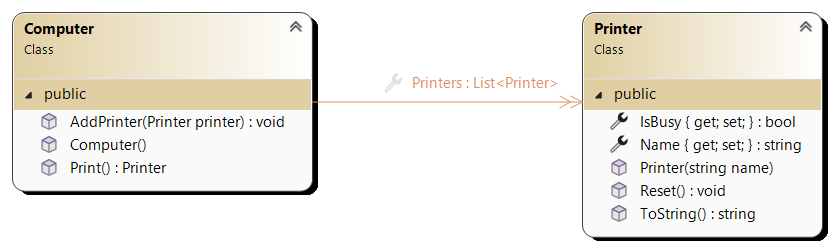

#### Show as Property (2)

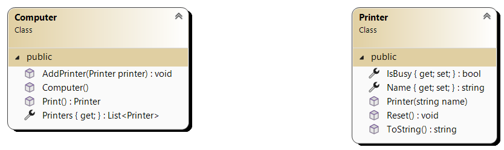

#### Additional Information – `Printer` Class:
- **Method `Reset`**: Cancels the print job.
- **`ToString()`**:
- If the printer is idle:  
  ```
  Printer Name: waiting for a print job
  ```
- If the printer is busy:  
  ```
  Printer Name: processing a print job
  ```

#### Additional Information – `Computer` Class:
- **Method `Print`**: Determines which printer is available.
- The available printer receives the print job.
- Return value is the printer that received the print job.
- If no printer is available, the message is lost.

### UI Design

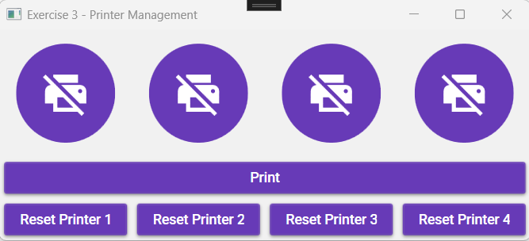

The four printer buttons are toggle buttons.

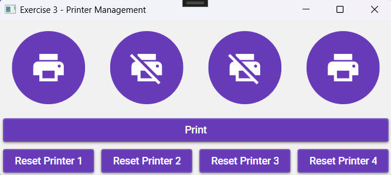

### Workflow

- When the form loads, **four printers and one PC** are created.
- The printers are added to the PC's printer list.

- The **PC acts as a print server**, distributing print jobs to the connected printers based on availability.
- Clicking the **"Print"** button checks which printer is available.
- The first available printer is used.
- The PC distributes tasks among printers.

- **If no printer is available, the message is lost.**
- To free up a printer, click **"Reset Printer"**.
- Once freed, the printer will be available for new print jobs.

- Use the following method to update the toggle button state:

```csharp
private void UpdateUI()
{
    btnPrinter1.IsChecked = _printer1.IsBusy;
    btnPrinter1.ToolTip = _printer1.ToString();
    btnPrinter2.IsChecked = _printer2.IsBusy;
    btnPrinter2.ToolTip = _printer2.ToString();
    btnPrinter3.IsChecked = _printer3.IsBusy;
    btnPrinter3.ToolTip = _printer3.ToString();
    btnPrinter4.IsChecked = _printer4.IsBusy;
    btnPrinter4.ToolTip = _printer4.ToString();
}
```