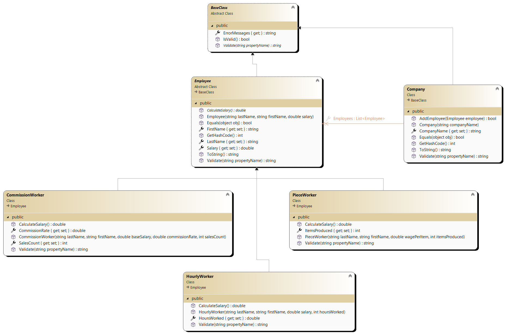
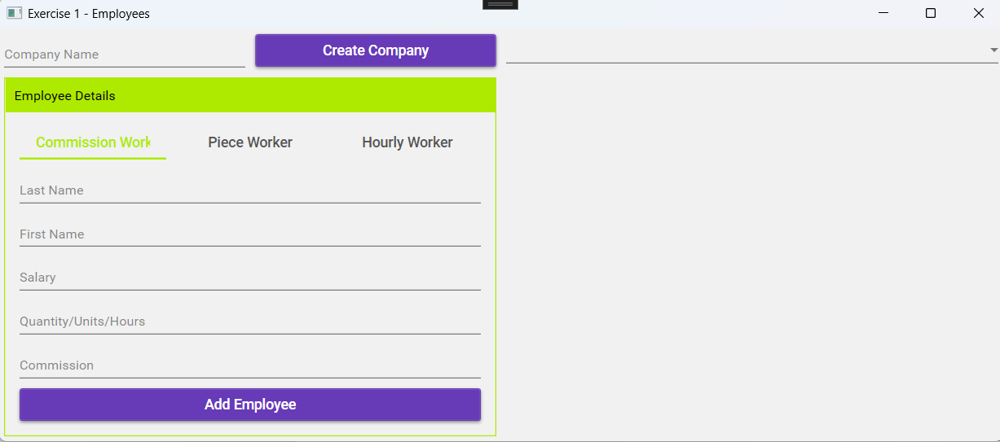
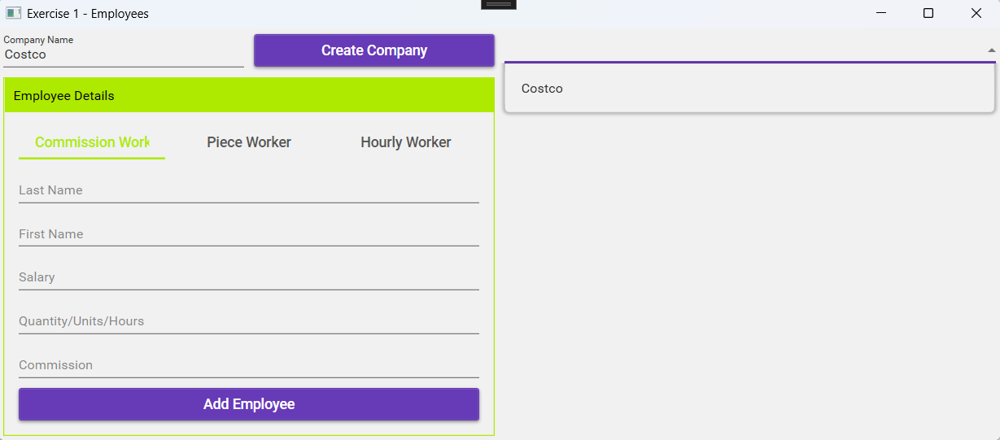
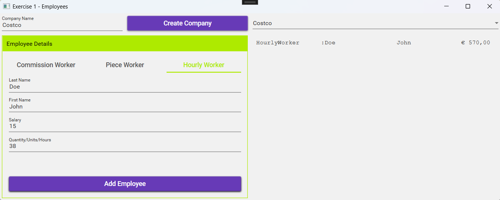

# Abstract Class Exercise

## Exercise 1 – Employees

### Objectives
- MaterialDesign: GroupBox, Button, TextBox, CheckBox
- Class Library
- Abstract Class

### Class Design



#### Additional Information – `BaseClass` Class:
- **Property `ErrorMessages`**: Returns a list of all error messages.
- **Method `IsValid()`**: Returns a `bool`, indicating whether there are error messages.

#### Additional Information – `Employee` Class:
- **Method `Equals`**: Two employees are considered the same if their first name and last name match.
- **Method `GetHashCode()`**: Based on the `Equals` comparison.
- **Method `ToString()`**: Returns a textual representation of the object as follows:
```
Type	Name	FirstName	CalculateSalary
```
- `Type`: The name of the type object.

**Example:**
```
PieceWorker Doe John 2500
```

- **Method `Validate()`**: Returns the validation error message for the requested property.
**Validations:**
- **Name**: Required field.
- **FirstName**: Required field.
- **Salary**: Cannot be below 0.

### Additional Information – `PieceWorker` Class:
- **Method `Validate()`**: Returns the validation error message for the requested property. Also applies the validations from the `Employee` class—call this method as well!
**Additional Validation:**
- **ItemsProduced**: Must not be below 0.
- **Method `CalculateSalary()`**: Returns: 
```
ItemsProduced * Salary
```

### Additional Information – `CommissionWorker` Class:
- **Method `Validate()`**: Returns the validation error message for the requested property. Also applies the validations from the `Werknemer` class—call this method as well!
**Additional Validations:**
- **SalesCount**: Must not be below 0.
- **CommissionRate**: Must not be below 0.
- **Method `CalculateSalary()`**: Returns:
```
Salary + (CommissionRate * SalesCount)
```

### Additional Information – `HourlyWorker` Class:
- **Method `Validate()`**: Returns the validation error message for the requested property. Also applies the validations from the `Werknemer` class—call this method as well!
**Additional Validation:**
- **HoursWorked**: Must not be below 0.
- **Method `CalculateSalary()`**: Hours exceeding 40 are paid double.

### Additional Information – `Company` Class:
- **Method `Equals`**: Two companies are considered the same if their company name matches.
- **Method `GetHashCode()`**: Based on the `Equals` comparison.
- **Method `ToString()`**: Returns the company name.
- **Method `AddEmployee()`**: Adds an employee to the list of employees.
- Duplicates are not allowed.
- If successfully added, the return value is `true`.
- If not added because the employee already exists, the return value is `false`.
- **Method `Validate()`**: Returns the validation error message for the requested property.
**Validation:**
- **CompanyName**: Required field.

## UI Design



## Workflow

- Clicking **"Create Company"** creates a company with the given name.
- After creation, the company is added to the list of companies, which is linked to a combo box.



- Clicking **"Add Employee"** adds an employee to the selected company.



- **Error messages** for:
- Creating a company
- Creating an employee
- Not selecting a company  
…will appear in a **message box**.

- **Ensure proper validation!**