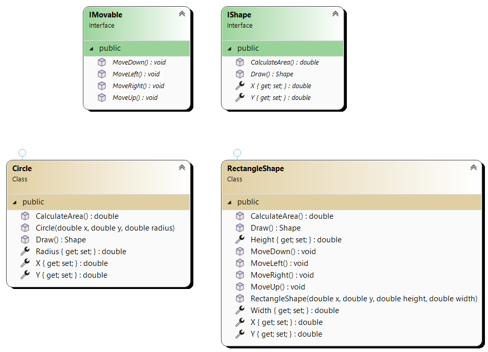
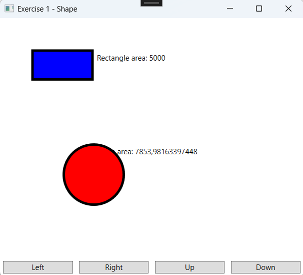
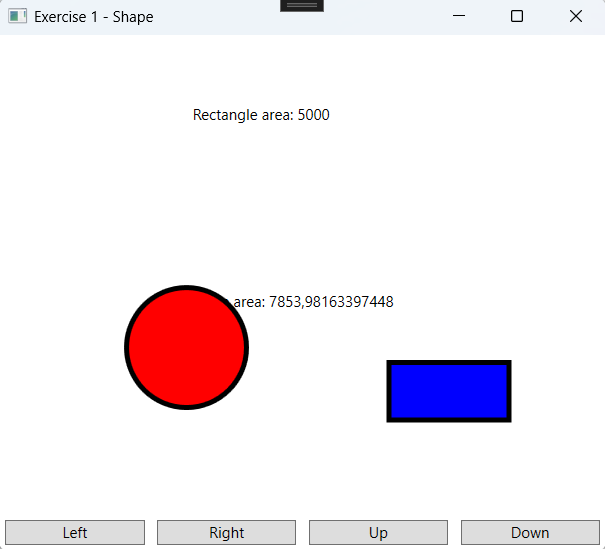

# Interfaces Exercise

## Exercise 1 – Figure

### Objectives
- Class Library
- Interfaces

### Class Design

Start from the provided example.

#### Additional Information – `RectangleShape` Class:
- **Method `MoveUp()`**: Decreases the y-value by 10.
- **Method `MoveDown()`**: Increases the y-value by 10.
- **Method `MoveLeft()`**: Decreases the x-value by 10.
- **Method `MoveRight()`**: Increases the x-value by 10.

### UI Design

### Workflow

- Clicking the **Left/Right/Up/Down** button changes the rectangle's position.
