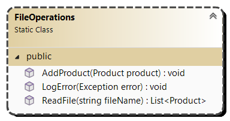
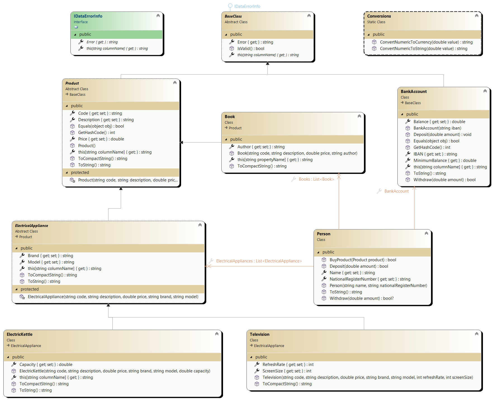
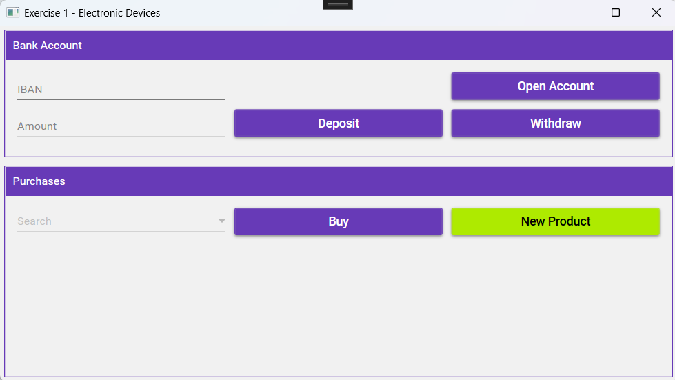
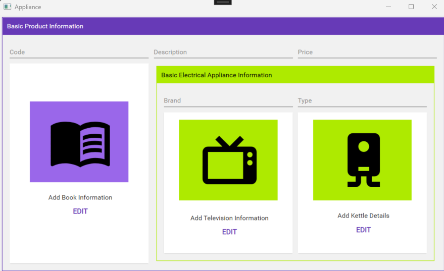
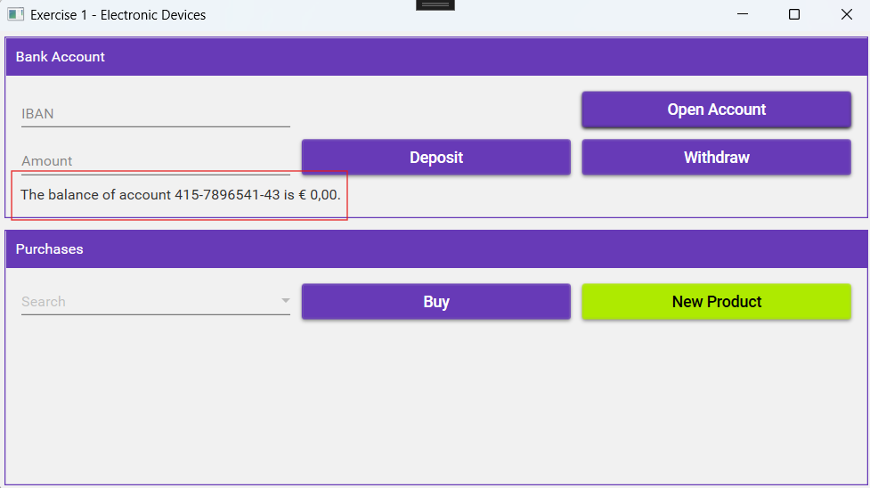
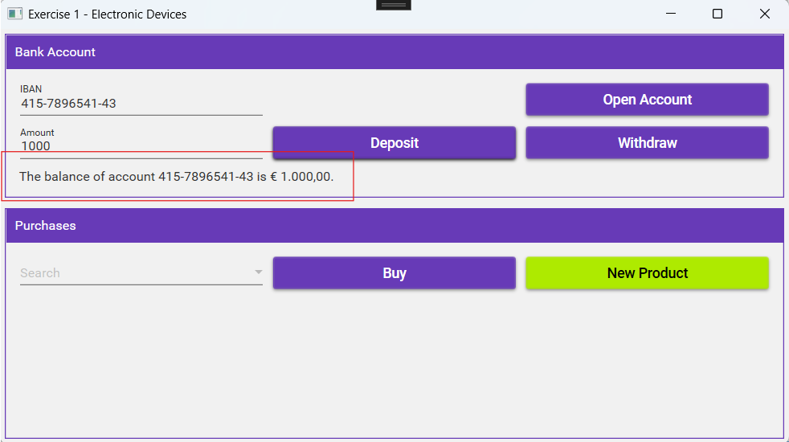
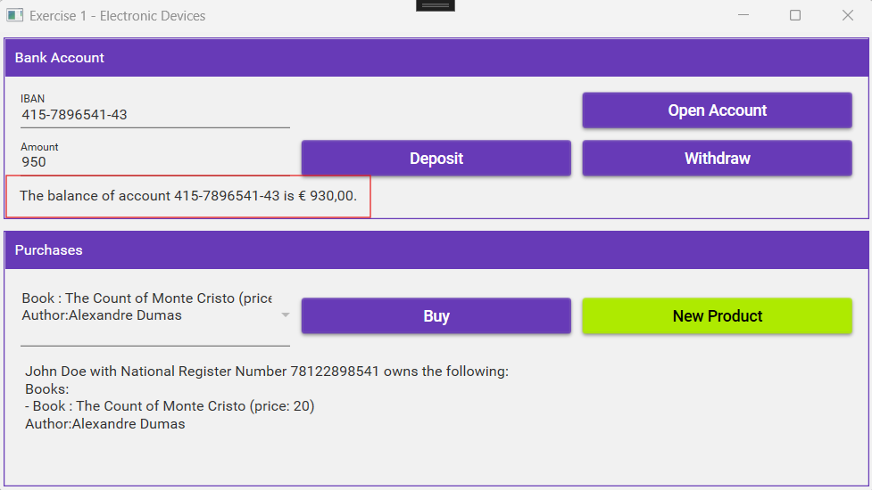
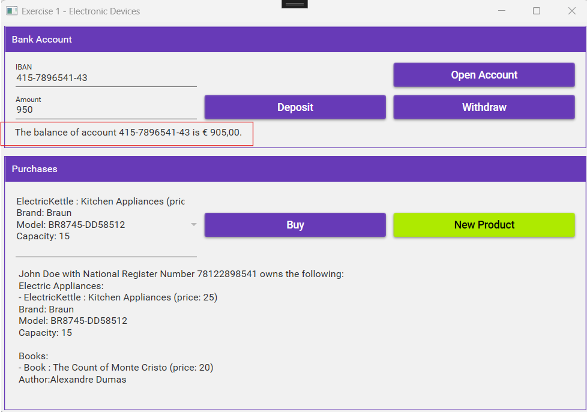
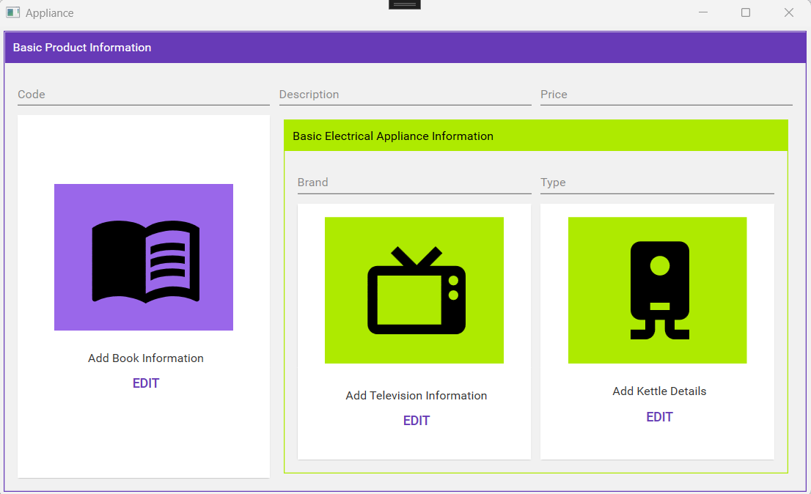
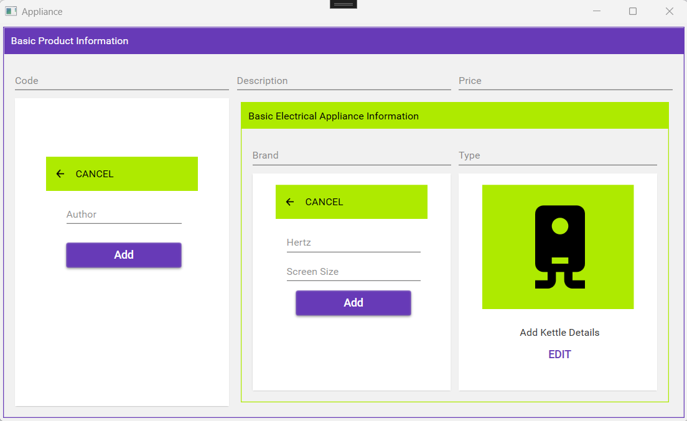

# .NET Interfaces Exercise

## Exercise 1 – Electrical Appliances

### Objectives
- Class Library
- Abstract Class
- .NET Interfaces
- Inheritance
- Single Relationship
- Multiple Relationships
- Static Class
- MaterialDesign: Flipper
- Working with Multiple Screens

### Class Design

First, study the provided schema on the next page!  
Make sure you understand the schema and ask the instructor if necessary.

You will receive a starter project where some classes are already provided but incomplete.  
You will need to complete them as necessary. The project will not compile in its initial state because there are still errors.  
The provided code is correct but incomplete!





#### Additional Information – `Product` Class:
- **Indexer `this[]`**: Validates the properties `Code`, `Description`, and `Price`.  
  `Code` and `Description` are required. `Price` cannot be less than 0.
- **`Equals`**: Two products are considered identical if their `Code` is the same.
- **`ToString()`**: Returns a textual representation of the object:

```
Classname: Description (price: Price)
```

- **`ToCompactString()`**: Returns a compact textual representation:

`Classname;Description;Price`

#### Additional Information – `Book` Class:
- **Indexer `this[]`**: Adds validation for `Author` on top of `Product` validations. `Author` is required.
- **`ToString()`**: Returns a textual representation:

```
Classname: Description (price: Price)
Author: Author
```

- **`ToCompactString()`**: Returns a compact textual representation:

```
Classname;Description;Price;Author
```

#### Additional Information – `ElectricalAppliance` Class:
- **Indexer `this[]`**: Adds validation for `Brand` and `Type` on top of `Product` validations. Both are required.
- **`ToString()`**: Returns a textual representation:

```
Classname: Description (price: Price) 
Brand: Brand 
Type: Type
```

- **`ToCompactString()`**: Returns a compact textual representation:

```
Classname;Description;Price;Brand;Type
```

#### Additional Information – `ElectricKettle` Class:
- **Indexer `this[]`**: Adds validation for `Capacity` on top of `ElectricalAppliance` validations. `Capacity` must be ≥ 0.
- **`ToString()`**: Returns a textual representation:

```
Classname: Description (price: Price) 
Brand: Brand 
Type: Type 
Capacity: Capacity
```
- **`ToCompactString()`**: Returns a compact textual representation:

```
Classname;Description;Price;Brand;Type;Capacity
```

#### Additional Information – `Television` Class:
- **Indexer `this[]`**: Adds validation for `RefreshRate` and `ScreenSize` on top of `ElectricalAppliance` validations. Both must be ≥ 0.
- **`ToString()`**: Returns a textual representation:

```
Classname: Description (price: Price) 
Brand: Brand 
Type: Type 
Herz: RefreshRate 
Screen Size: Screen Size
```

- **`ToCompactString()`**: Returns a compact textual representation:

Classname;Description;Price;Brand;Type;Hertz;Screen Size

#### Additional Information – `BankAccount` Class:
- **Property `Balance`**: Read-only from outside (private set).
- **Indexer `this[]`**: Adds validation for `IbanNumber` on top of `ElectricalAppliance` validations.  
`IbanNumber` is required, and `Balance` cannot be less than the minimum balance.
- **Constructor**: Sets the minimum balance to -100.
- **`ToString()`**: Returns a textual representation:

The balance of account IbanNumber is Balance

*Balance should be displayed as currency using the method `ConvertNumericToCurrency`.* 
- **`Equals`**: Two accounts are considered identical if their `IbanNumber` is the same.
- **`Deposit`**: Adds the absolute value of the amount to `Balance`.
- **`Withdraw`**: Withdraws the absolute value from `Balance` *if it does not drop below the minimum*.  
Returns `true` if successful, `false` if funds are insufficient.

#### Additional Information – `Person` Class:
- **Properties `ElectricalAppliances` and `Books`**: Read-only.
- **`BuyProduct()`**: Deducts the product price from the account using `Withdraw()`.  
If successful, adds the product to the appropriate list (`ElectricalAppliances` or `Books`).  
Returns `true` if the purchase was successful.
- **`Deposit()`**: Deposits an amount into the account.  
Returns `true` if successful, `false` if no account exists.
- **`Withdraw()`**: Withdraws an amount from the account.  
Returns `true` if successful, or `false` if no account exists.
- **`ToString()`**: Returns a textual representation:

```
Name with NationalRegisterNumber owns the following: 

Electrical Appliances:
- … 
- … 
Books:
- … 
- …
```

## UI Design

### `MainWindow`



- **When clicking "New Product"**: Opens `ApplianceWindow` modally.



## Workflow

### Initial Setup
- When loading the form, create a `Person` object with a name and RRnr.

### Loading `MainWindow`
- Reads `products.txt` and populates the combo box `cmbProducts`.

### Opening a Bank Account
- The user starts without a bank account and must create one.
- The bank account is linked to the person.
- Ensure proper validation.
- After creation, the balance is displayed in the label.



### Depositing Money
- Adds money to the user’s bank account.
- Handles cases where the user has no account.
- Updates `lblBankAccount` to reflect the correct balance.



### Withdrawing Money
- Deducts money from the user's account.
- Handles cases:
- Insufficient funds.
- No bank account exists.
- Non-numeric input.
- Updates `lblBankAccount` accordingly.


### Purchasing a Product
- The selected item is purchased using `BuyProduct()`.
- Handles cases:
- Insufficient funds.
- No product selected.





### Adding a New Product
- Opens a second modal window.
- New products are visible in the combo box after closing the window.



- Users select the product type, enter details, and click "Add."
- Ensures valid products only.
- Valid products are added to `products.txt`.

