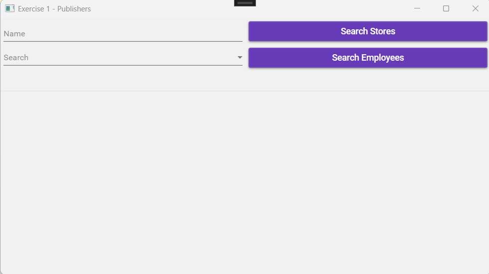
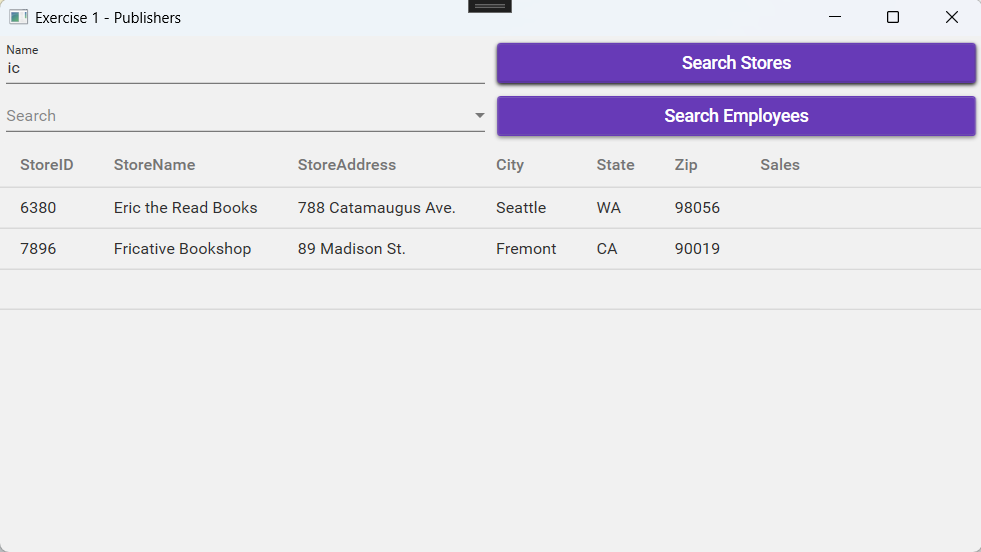
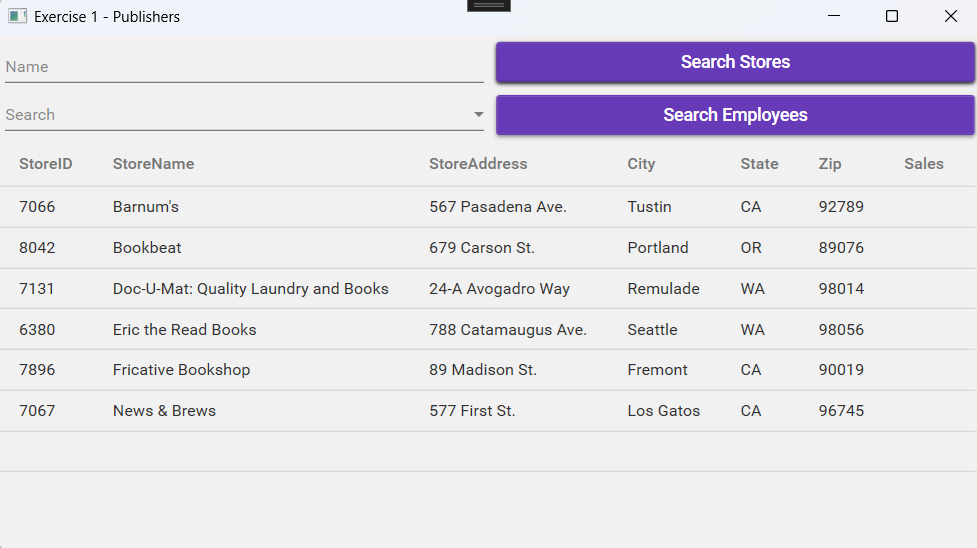
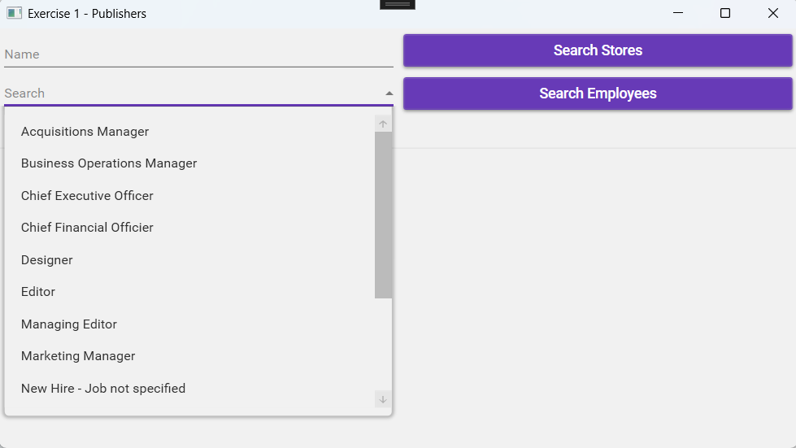
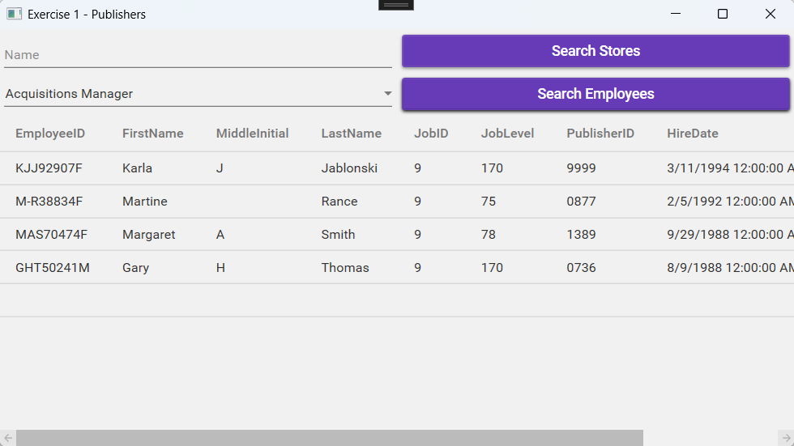

# ADO.NET Entity Framework Exercise

## Exercise 1 – Publishers

### Entity Framework

Create the Entity Framework model using the `Publishers` tables.  
Ensure that the entity names and navigation properties are correctly named.

### UI Design

#### `MainWindow`

### Workflow

- **Searching for Stores:**  
  - When clicking **‘Search Stores’**, the data grid is populated with stores that match the criteria.  
  - If no criteria are entered, all stores are displayed.  
  - Stores are sorted by `StoreName`.

- **Loading the Form:**  
  - The combo box `cmbJobs` is populated with `Job` objects.  
  - The job description is displayed.  
  - Jobs are sorted by description.

- **Searching for Employees:**  
  - When clicking **‘Search Employees’**, employees practicing the selected job are retrieved.

