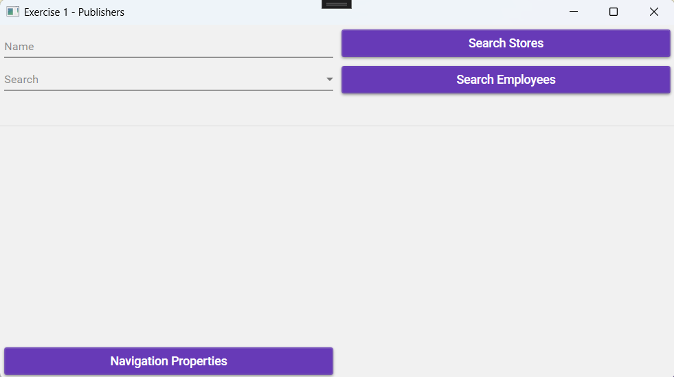
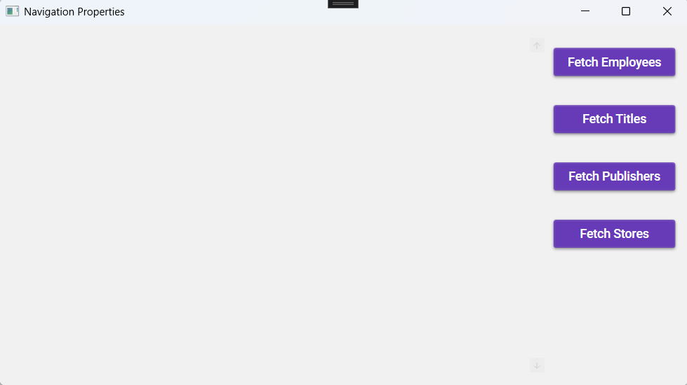
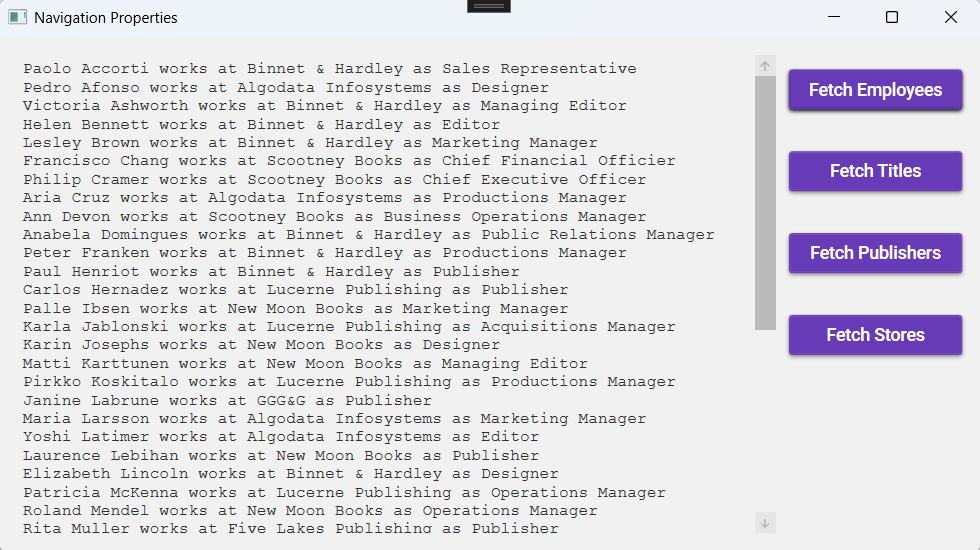
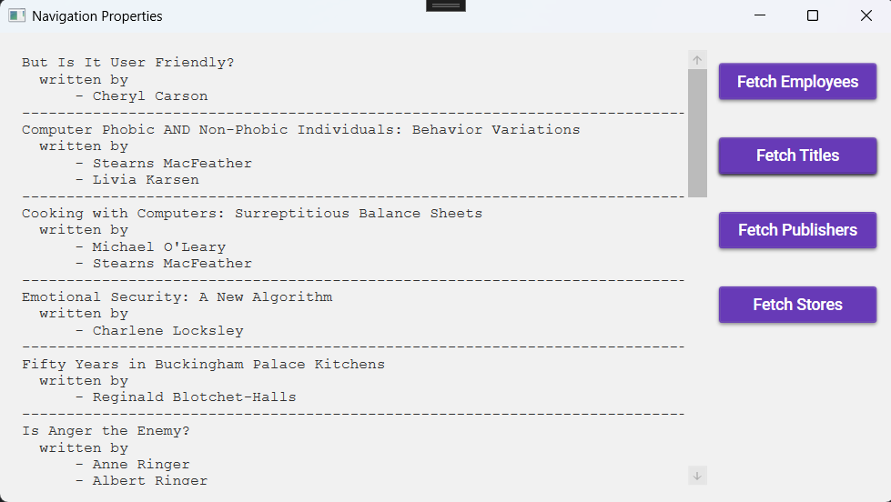
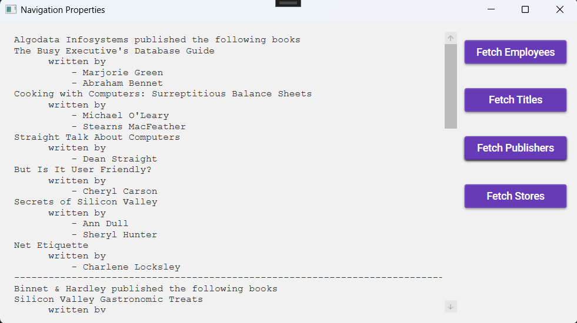
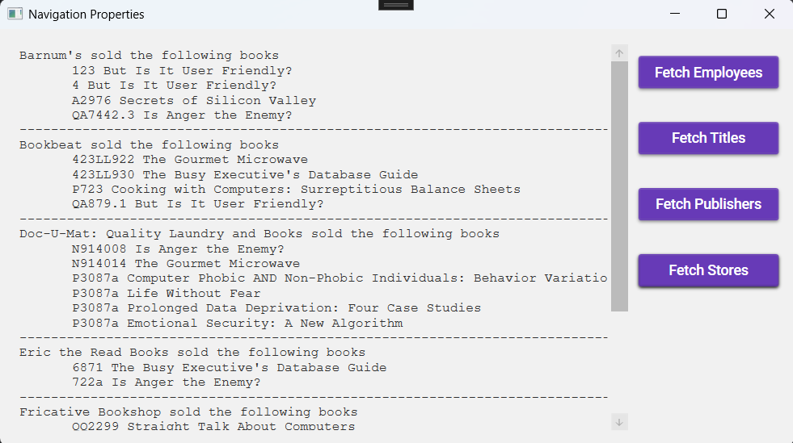

# Entity Framework Navigation Properties Exercise

## Exercise 1 – Publishers

### Entity Framework

Continue working on the exercise from **NETEntityFrameworkExercise**.

### UI Design

#### `MainWindow`
- Add a button to open another window.

#### `Second Window`
- Create a second screen.

#### Workflow

- **Fetching Employees:**  
  - When clicking **‘Fetch Employees’**, the label is populated with employees.  
  - Sorting is done by the publisher's name.  
  - The following details are displayed:  
    - **Employee:** First name, Last name  
    - **Publisher:** Name  
    - **Job:** Description  

- **Fetching Titles:**  
  - When clicking **‘Fetch Titles’**, the label is populated with different titles and their respective authors.  
  - Sorting is done by title.  
  - The following details are displayed:  
    - **Title:** Name  
    - **Author:** First name, Last name  

- **Fetching Publishers:**  
  - When clicking **‘Fetch Publishers’**, the label is populated with publishers, the titles they have published, and the authors who wrote the books.  
  - Sorting is done by the publisher's name.  
  - The following details are displayed:  
    - **Publisher:** Name  
    - **Title:** Name  
    - **Author:** First name, Last name  

- **Fetching Stores:**  
  - When clicking **‘Fetch Stores’**, the label is populated with stores, order numbers, and their associated titles.  
  - Sorting is done by the publisher's name.  
  - Determine from which tables this data originates.  

