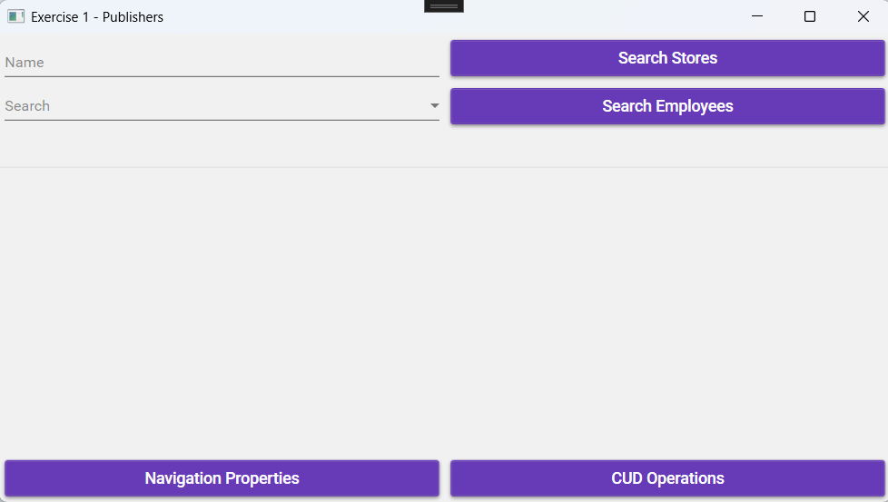
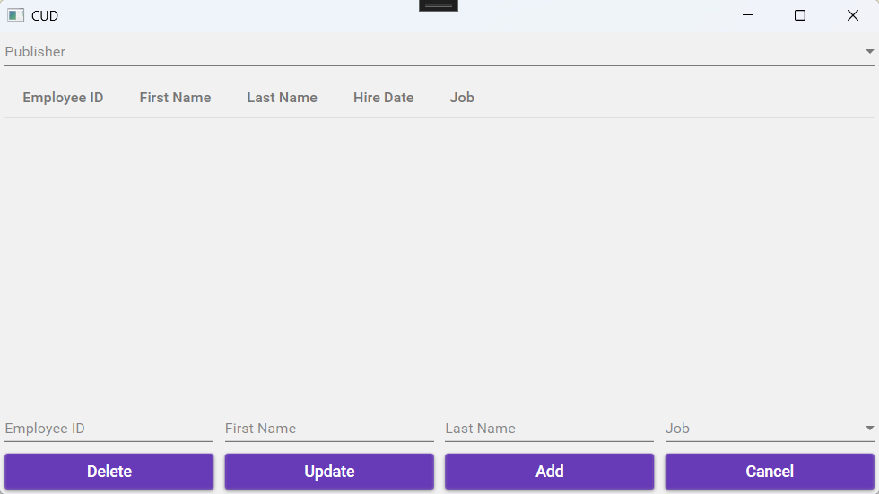
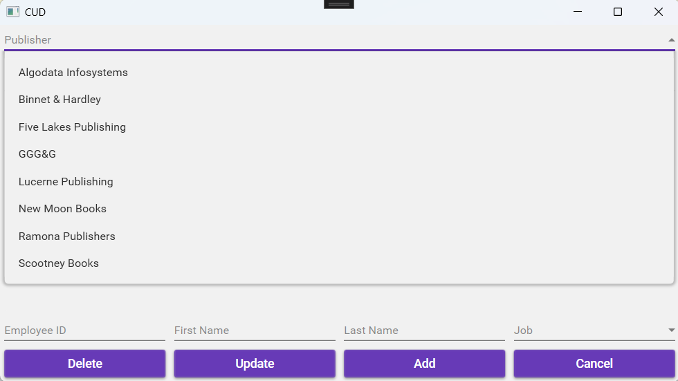
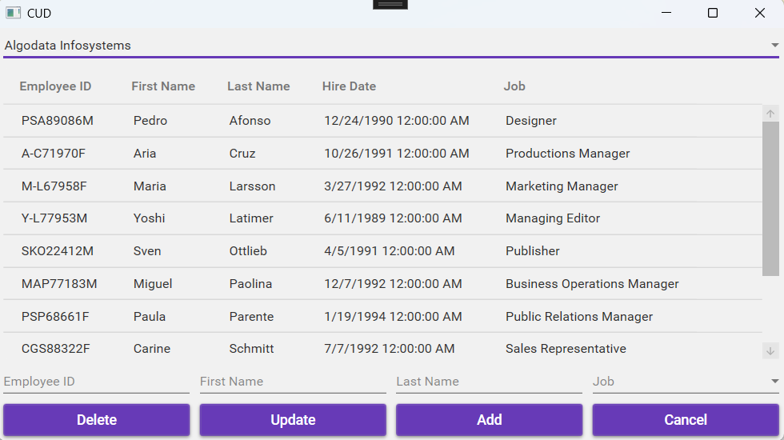
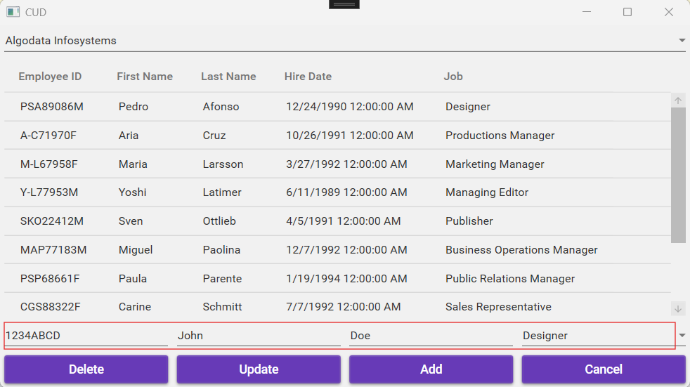
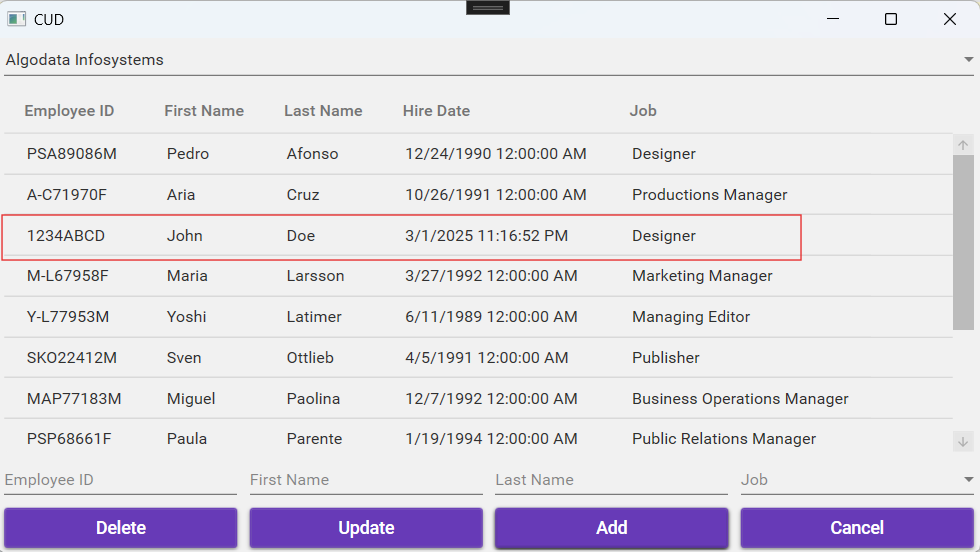
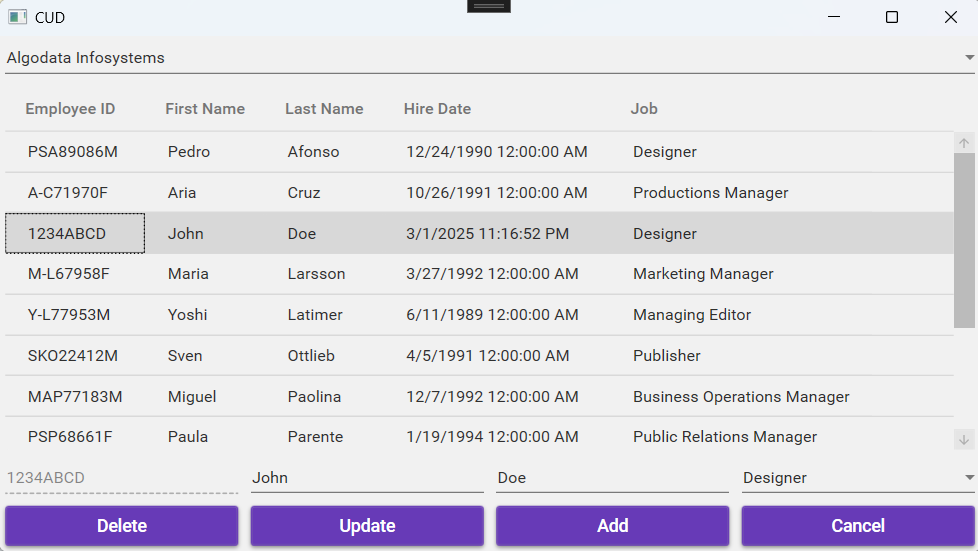
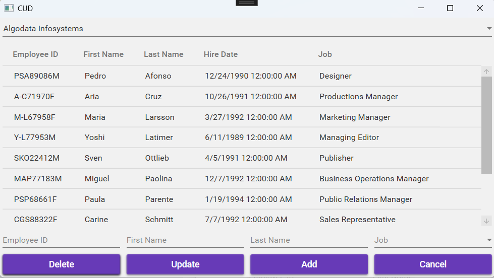
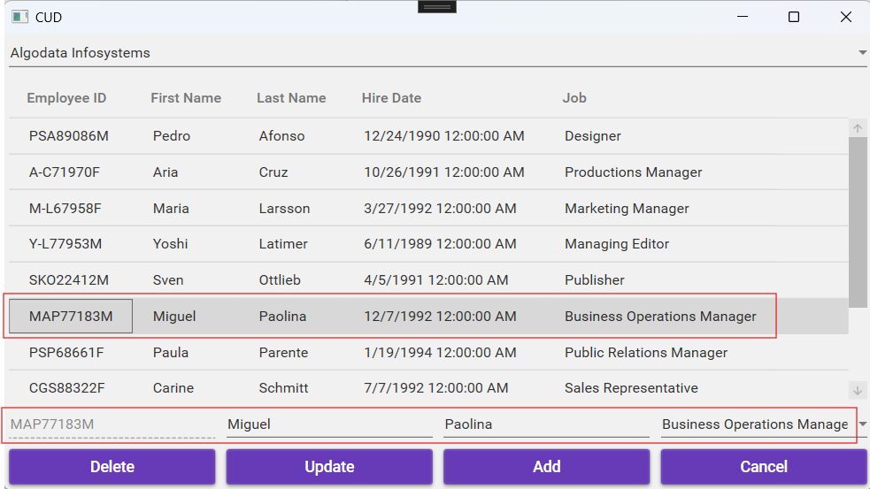

# Entity Framework CUD Exercise

## Exercise 1 – Publishers

### Entity Framework

Continue working on the **EFNavigationPropertiesExercise** exercise.

### UI Design

#### `MainWindow`
- Add a button to open another screen.

#### `Third Window`
- Create a third screen.

### Workflow

- **Loading the Form:**
  - The combobox `cmbPublishers` is populated with all publishers.
  - The publisher's name is displayed.

- **Selecting a Publisher:**
  - When a publisher is selected, all employees are shown in a **datagrid**.
  - Only the following fields are displayed in the datagrid:  
    - **EmployeeID**, **First Name**, **Last Name**, **Hire Date**, **Job**  
  - The datagrid is **not editable**.

- **Adding an Employee:**
  - Clicking **‘Add’** adds the entered details to the database.
  - Changes are only allowed if **all validations** pass.
  - Errors related to **duplicate primary keys (PK)** must be handled!

- **Deleting an Employee:**
  - Clicking **‘Delete’** removes the selected employee from the database.

- **Selecting an Employee:**
  - When selecting an employee, the following fields are filled in:
    - `txtFirstName`, `txtLastName`, `txtEmployeeID`
    - The combobox `cmbJobs` displays the correct job.
  - **`txtEmployeeID` is not editable.**

- **Updating an Employee:**
  - Clicking **‘Update’** updates the modified details (**First Name, Last Name, Job**) in the database.
  - The **datagrid is refreshed**, and all fields are cleared.
  - Changes are only allowed if **all validations** pass.

### ⚠️ **IMPORTANT** ⚠️  
If a **foreign key (FK) of an existing object** is modified and the associated **navigation property** is also populated, **both the FK and the navigation property must be updated**.  
Otherwise, the update **will fail**!

For example:  
- If `Job_id` (**FK**) is updated, the **navigation property `Job`** must also be updated!  
